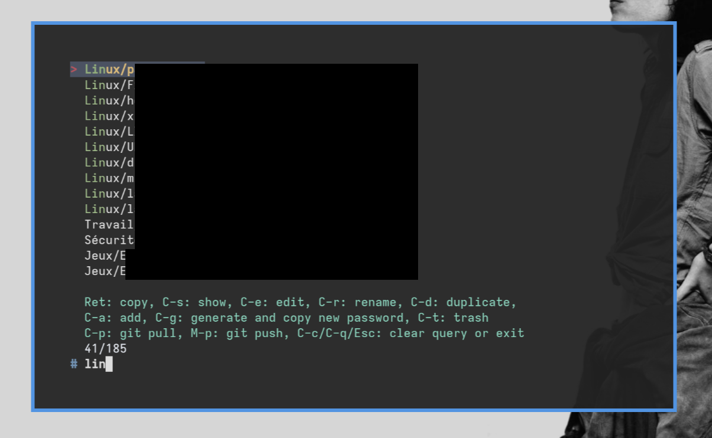

```

                                          .d888           .d888 
                                         d88P"           d88P"  
                                         888             888    
     88888b.   8888b.  .d8888b  .d8888b  888888 88888888 888888 
     888 "88b     "88b 88K      88K      888       d88P  888    
     888  888 .d888888 "Y8888b. "Y8888b. 888      d88P   888    
     888 d88P 888  888      X88      X88 888     d88P    888    
     88888P"  "Y888888  88888P'  88888P' 888    88888888 888    
     888                                                        
     888                A fzf wrapper for pass and pass-tomb
     888    
     
```

`passfzf` is a simple `fzf` wrapper for [`pass`](https://www.passwordstore.org/) (the UNIX password-store). It supports [`pass-tomb`](https://github.com/roddhjav/pass-tomb) but does not require it, and allows fuzzy finding your `pass` passwords to copy, show, edit, delete, rename and duplicate them. It also supports adding add or generating new passwords, as well as synchronizing the password store with a remote `git` repository.

There are already `pass` extensions doing similar things, but they are not available for all distributions and I prefer using a simple shell script with minimal dependencies that I can easily customize instead of depending on an extension. 



## Dependencies
`fd`, `fzf` and `pass` are mandatory dependencies and should be available from the package manager of any distribution. `git` and `pass-tomb` are optional.

## Usage
Just make sure you followed the instructions to create your GPG key and initialize your `pass` password store, and possibly your `pass-tomb`, see their respective repositories linked above. Likewise, pushing to or pulling from `git` using `passfzf` requires that you have initialized a repository inside your password store, which is also detailed in the `pass` instructions.

From there, just make the script executable with `chmod +x /path/to/passfzf` and place it somewhere in your `PATH` or launch it in a new terminal window using a keybind in your desktop environment.

If your password store is in a non-standard location, you may have to edit the script accordingly, but this should be straightforward.

For convenience, I prefer typing my GPG passphrase in a terminal (in this case, the window that opens when I hit the `passfzf` keybind in my Sway configuration) than in a GUI pop-up. This is how I edited my `~/.gnupg/gpg-agent.conf` to do so (namely the last two options):

```
# Time the passphrase is kept in cache after each invocation of GnuPG
default-cache-ttl 60

# Time before the cache is wiped
max-cache-ttl 60

# Allow filling the passphrase directly in terminal instead of GUI
allow-loopback-pinentry

# Allow CLI pinentry by default
pinentry-program /home/mat/.guix-profile/bin/pinentry-curses
```
